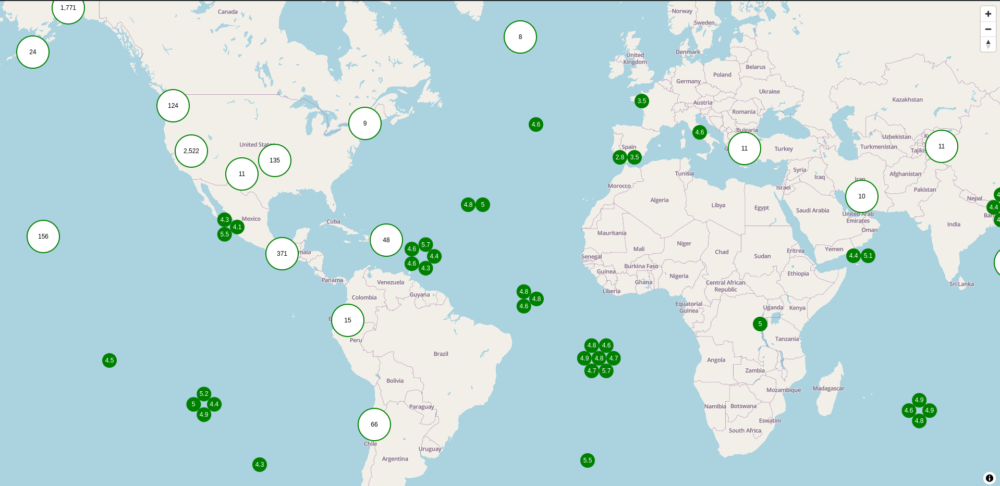

# MapLibre GL Teritorio Cluster

Enhance MapLibre GL JS with fully interactive HTML-based clusters and markers.

**Features:**
- 🧱 Renders native MapLibre GL JS clusters as HTML elements
- 🌀 Smart unfolded clusters (circle, hexagrid, grid) based on zoom level and item count
- 📌 Pin marker display on feature click
- 🔍 Interact with overlapping markers without needing to zoom in
- 🚫 Avoids the need to uncluster or zoom for interaction
---
## Demo

👉 [**Live Demo**](https://teritorio.github.io/maplibre-gl-teritorio-cluster/index.html)


## Installation

Install @teritorio/maplibre-gl-teritorio-cluster with yarn

```bash
  yarn add @teritorio/maplibre-gl-teritorio-cluster
```

Or use it from CDN
```html
<script type="module" src="https://unpkg.com/@teritorio/maplibre-gl-teritorio-cluster/dist/maplibre-gl-teritorio-cluster.js"></script>
```

## Usage/Examples

> [!WARNING]
> Set your GeoJSON source with `clusterMaxZoom: 22` in order to let the plugin handle cluster/individual marker rendering across all zoom level

```javascript
import { TeritorioCluster } from '@teritorio/maplibre-gl-teritorio-cluster'
import maplibregl from 'maplibre-gl'
import 'maplibre-gl/dist/maplibre-gl.css'

const map = new maplibregl.Map({
  container: 'map',
  style: {
    version: 8,
    name: 'Empty Style',
    metadata: { 'maputnik:renderer': 'mlgljs' },
    sources: {
      points: {
        type: 'geojson',
        cluster: true,
        clusterRadius: 80,
        clusterMaxZoom: 22, // Required
        data: {
          type: 'FeatureCollection',
          features: [
            {
              type: 'Feature',
              properties: { id: 1 },
              geometry: { type: 'Point', coordinates: [0, 0] }
            },
            {
              type: 'Feature',
              properties: { id: 2 },
              geometry: { type: 'Point', coordinates: [0, 1] }
            }
          ]
        }
      }
    },
    glyphs: 'https://orangemug.github.io/font-glyphs/glyphs/{fontstack}/{range}.pbf',
    layers: [],
    id: 'muks8j3'
  }
})

map.on('load', () => {
  const teritorioLayer = new TeritorioCluster(
    'teritorio-cluster-layer',
    'points',
    options
  )

  // Add the layer to map
  map.addLayer(teritorioLayer)

  // Subscribe to feature click event
  teritorioLayer.addEventListener('feature-click', (event) => {
    console.log(event.detail.selectedFeature)
  })
})

// Create whatever HTML element you want as Cluster
function clusterRender(element, props) {}

// Create whatever HTML element you want as individual Marker
function markerRender(element, feature, markerSize) {}

// Create whatever HTML element you want as Pin Marker
function pinMarkerRender(coords, offset) {}
```

## API Reference

#### Constructor

```js
const teritorioLayer = new TeritorioCluster(id, sourceId, options)
```

| Parameter  | Type                               | Description                              |
| ---------- | ---------------------------------- | ---------------------------------------- |
| `id`       | `string`                           | Unique ID for the layer.          |
| `sourceId` | `string`                           | ID of the GeoJSON source.                 |
| `options`  | `Partial<TeritorioClusterOptions>` | Optional configuration overrides. |

#### Options

| Option                     | Type                          | Default                      | Description                                                    |
| -------------------------- | ----------------------------- | ---------------------------- | -------------------------------------------------------------- |
| `clusterMaxZoom`           | `number`                      | `17`                         | Maximum zoom level where clusters are visible.                 |
| `clusterMinZoom`           | `number`                      | `0`                          | Minimum zoom level where clustering starts.                    |
| `clusterRender`            | `(feature) => HTMLElement`    | `clusterRenderDefault`       | Custom function to render cluster.                     |
| `markerRender`             | `(feature) => HTMLElement`    | `markerRenderDefault`        | Custom function to render individual markers.                  |
| `markerSize`               | `number`                      | `24`                         | Pixel size of rendered markers.                                |
| `unfoldedClusterRender`    | `(features) => HTMLElement[]` | `unfoldedClusterRenderSmart` | Function to render unfolded cluster.                   |
| `unfoldedClusterMaxLeaves` | `number`                      | `7`                          | Maximum number of features to show when a cluster is unfolded. |
| `fitBoundsOptions`         | `mapboxgl.FitBoundsOptions`   | `{ padding: 20 }`            | Options for [fitBounds](https://maplibre.org/maplibre-gl-js/docs/API/classes/Map/#fitbounds) method                              |
| `initialFeature`           | `GeoJSONFeature \| undefined` | `undefined`                  | Feature to auto-select on load.                                |
| `pinMarkerRender`          | `(feature) => HTMLElement`    | `pinMarkerRenderDefault`     | Custom renderer for the pinned marker.                         |

## Events

```js
teritorioLayer.addEventListener('feature-click', (event) => {
  console.log('Selected feature:', event.detail.selectedFeature)
})
```
## Run Locally

Clone the project

```bash
  git clone https://github.com/teritorio/maplibre-gl-teritorio-cluster.git
```

Go to the project directory

```bash
  cd maplibre-gl-teritorio-cluster
```

Install dependencies

```bash
  yarn install
```

Start the server

```bash
  yarn dev
```

## Contributing

Contributions are always welcome!

See [`CONTRIBUTING.md`](CONTRIBUTING.md) for ways to get started.

## Authors

- [Teritorio](https://teritorio.fr)
## License

[MIT](https://choosealicense.com/licenses/mit/)
