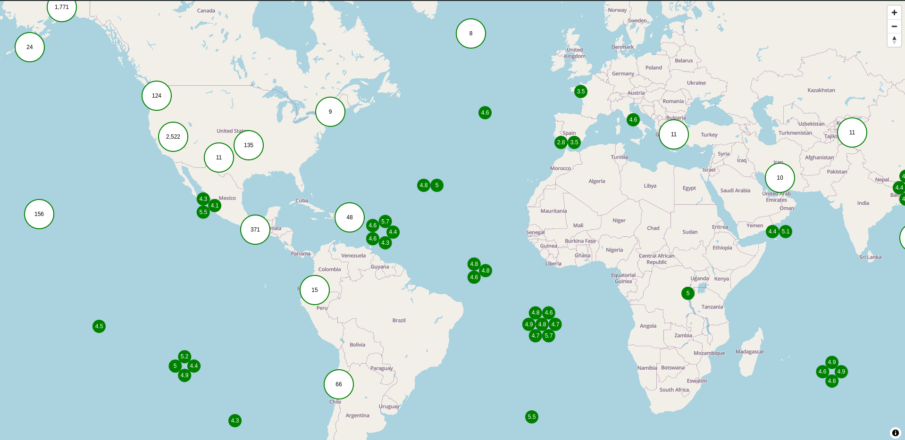

# MapLibre GL Teritorio Cluster

Render native MapLibre GL JS clusters as HTML marker.

Renders:
- HTML cluster
- HTML Unfolded cluster defined by a minimum leaves and min / max zoom threshold
- Pin Marker on feature click

Allow visualization and interaction with all markers, even when superposed.
Can display and interact with small cluster without the need to zoom or uncluster.

See the [Demo page](https://teritorio.github.io/maplibre-gl-teritorio-cluster/index.html).



## Usage

Install as a dependency
```bash
yarn add @teritorio/maplibre-gl-teritorio-cluster
```

Or use it from CDN
```html
<script type="module" src="https://unpkg.com/@teritorio/maplibre-gl-teritorio-cluster/dist/maplibre-gl-teritorio-cluster.js"></script>
```

> [!WARNING]
> Set your GeoJson source with `clusterMaxZoom: 22` in order to let the plugin handle cluster/individual marker rendering across all zoom level

```js
import { TeritorioCluster } from '@teritorio/maplibre-gl-teritorio-cluster'
import { Map } from 'maplibre-gl'

const map = new Map({
  container: 'map',
  style: {
    version: 8,
    name: 'Empty Style',
    metadata: { 'maputnik:renderer': 'mlgljs' },
    sources: {
      points: {
        type: 'geojson',
        cluster: true,
        clusterRadius: 80,
        clusterMaxZoom: 22, // Required
        data: {
          type: 'FeatureCollection',
          features: [
            {
              type: 'Feature',
              properties: { id: 1 },
              geometry: { type: 'Point', coordinates: [0, 0] }
            },
            {
              type: 'Feature',
              properties: { id: 2 },
              geometry: { type: 'Point', coordinates: [0, 1] }
            }
          ]
        }
      }
    },
    glyphs: 'https://orangemug.github.io/font-glyphs/glyphs/{fontstack}/{range}.pbf',
    layers: [
      {
        id: 'cluster',
        type: 'circle',
        source: 'points'
      }
    ],
    id: 'muks8j3'
  }
})

map.on('load', () => {
  const teritorioCluster = new TeritorioCluster(map, 'points', options)

  // Get feature click event
  teritorioCluster.addEventListener('click', (e) => {
    console.log(e.detail.selectedFeature)
  })
})

// Create whatever HTML element you want as Cluster
function clusterRender(element, props) {}

// Create whatever HTML element you want as individual Marker
function markerRender(element, feature, markerSize) {}

// Create whatever HTML element you want as Pin Marker
function pinMarkerRender(coords, offset) {}
```

## API

- [TeritorioCluster](#teritoriocluster)
  - [Parameters](#parameters)
  - [Options](#options)
  - [Methods](#methods)
  - [addEventListener](#addeventlistener)

### TeritorioCluster

Create a new Maplibre GL JS plugin for feature (cluster / individual marker) rendering

#### Parameters
| Name     | Type                                                               | Description                                                                                      | Required | Default value |
|----------|--------------------------------------------------------------------|--------------------------------------------------------------------------------------------------|----------|---------------|
| map      | [`Map`](https://maplibre.org/maplibre-gl-js/docs/API/classes/Map/) | The Map object represents the map on your page                                                   | ✅        | ❌             |
| sourceId | `string`                                                           | The ID of the source. Should be a vector source, preferably of type GeoJSON and not vector tiles | ✅        | ❌             |
| options  | `object`                                                           | Options to configure the plugin                                                                  | ❌        | `undefined`   |

#### Options
| Name                          | Type                                                                                                                                                                                                           | Description                                                                                             | Required | Default value                                       |
|-------------------------------|----------------------------------------------------------------------------------------------------------------------------------------------------------------------------------------------------------------|---------------------------------------------------------------------------------------------------------|----------|-----------------------------------------------------|
| clusterMaxZoom                | `number`                                                                                                                                                                                                       | Maximal zoom level at which we force the rendering of the Unfolded Cluster                              | ❌        | `17`                                                |
| clusterMinZoom                | `number`                                                                                                                                                                                                       | Minimal zoom level at which we force the rendering of the Unfolded Cluster                              | ❌        | `0`                                                 |
| clusterRenderFn               | `(element: HTMLDivElement, props: MapGeoJSONFeature['properties']): void`                                                                                                                                      | Cluster render function                                                                                 | ❌        | `src/utils/helpers.ts/clusterRenderDefault()`       |
| fitBoundsOptions              | [`FitBoundsOptions`](https://maplibre.org/maplibre-gl-js/docs/API/type-aliases/FitBoundsOptions)                                                                                                               | Options for [Map#fitBounds](https://maplibre.org/maplibre-gl-js/docs/API/classes/Map/#fitbounds) method | ❌        | `{ padding: 20 }`                                   |
| initialFeature                | [`MapGeoJSONFeature`](https://maplibre.org/maplibre-gl-js/docs/API/type-aliases/MapGeoJSONFeature/)                                                                                                            | Feature to select on initial rendering                                                                  | ❌        | `undefined`                                         |
| markerRenderFn                | `(element: HTMLDivElement, feature: MapGeoJSONFeature, markerSize: number): void`                                                                                                                              | Individual Marker render function                                                                       | ❌        | `src/utils/helpers.ts/markerRenderDefault()`        |
| markerSize                    | `number` (in px)                                                                                                                                                                                               | Size of Marker                                                                                          | ❌        | `24`                                                |
| unfoldedClusterRenderFn       | `(parent: HTMLDivElement, items: MapGeoJSONFeature[], markerSize: number, renderMarker: (feature: MapGeoJSONFeature) => HTMLDivElement, clickHandler: (e: Event, feature: MapGeoJSONFeature) => void) => void` | Unfolded Cluster render function                                                                        | ❌        | `src/utils/helpers.ts/unfoldedClusterRenderSmart()` |
| unfoldedClusterRenderSmart    | Mix between Circular and HexaShape shape Unfolded Cluster render function                                                                                                                                      | -                                                                                                       | -        | -                                                   |
| unfoldedClusterRenderGrid     | Grid shape Unfolded Cluster render function function                                                                                                                                                           | -                                                                                                       | -        | -                                                   |
| unfoldedClusterRenderCircle   | Circular shape Unfolded Cluster render function function                                                                                                                                                       | -                                                                                                       | -        | -                                                   |
| unfoldedClusterRenderHexaGrid | HexaGrid shape Unfolded Cluster render function function                                                                                                                                                       | -                                                                                                       | -        | -                                                   |
| unfoldedClusterMaxLeaves      | `number`                                                                                                                                                                                                       | Unfolded Cluster max leaves number                                                                      | ❌        | `7`                                                 |
| pinMarkerRenderFn             | `(coords: LngLatLike, offset: Point): Marker`                                                                                                                                                                  | Pin Marker render function                                                                              | ❌        | `src/utils/helpers.ts/pinMarkerRenderDefault()`     |

#### Methods
| Name                 | Type                                                                                                                   | Description                                                                                                     |
|----------------------|------------------------------------------------------------------------------------------------------------------------|-----------------------------------------------------------------------------------------------------------------|
| addEventListener     | ('feature-click', (e: Event) => void)                                                                                  | Listen to feature click and return a [`MapGeoJSONFeature`](https://maplibre.org/maplibre-gl-js/docs/API/type-aliases/MapGeoJSONFeature/) from `e.detail.selectedFeature` for external control. |
| resetSelectedFeature | () => void                                                                                                             | Remove selected feature and associated Pin Marker                                                               |
| setBoundsOptions     | (options: [`FitBoundsOptions`](https://maplibre.org/maplibre-gl-js/docs/API/type-aliases/FitBoundsOptions)) => void    | Update Map's visible area                                                                                       |
| setSelectedFeature   | (feature: [`MapGeoJSONFeature`](https://maplibre.org/maplibre-gl-js/docs/API/type-aliases/MapGeoJSONFeature/)) => void | Set selected feature and display Pin Marker on top of it                                                        |

## Dev
Install dependencies
```bash
yarn install
```

Serve the demo page
```bash
yarn dev
```

## Requirements

Requires [maplibre-gl-js](https://github.com/maplibre/maplibre-gl-js) >= v4.0.0.

## Contribution

Please see the [contribution guide](CONTRIBUTING.md).

## Author

[Teritorio](https://teritorio.fr)
